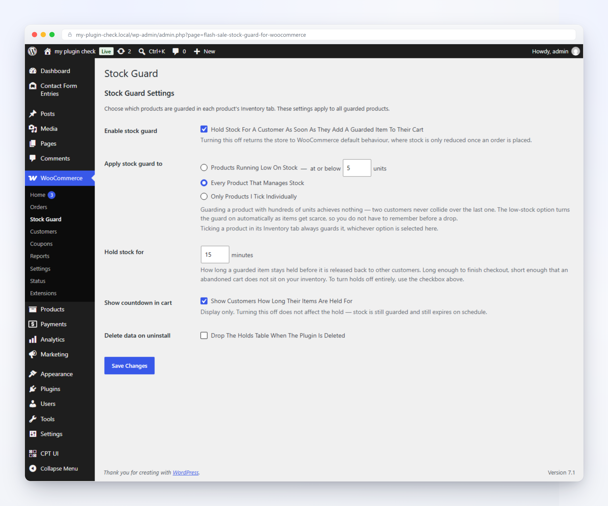
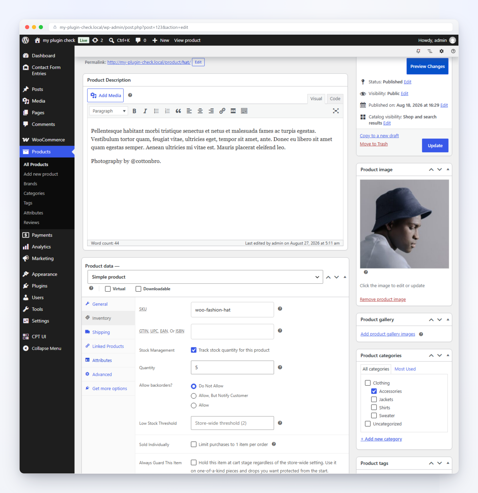
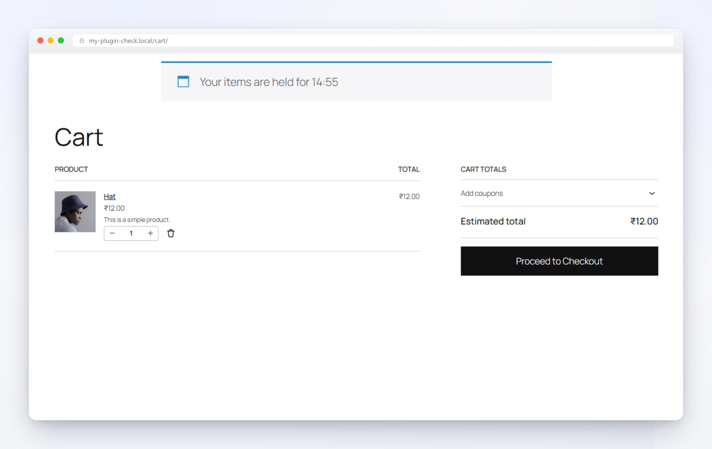
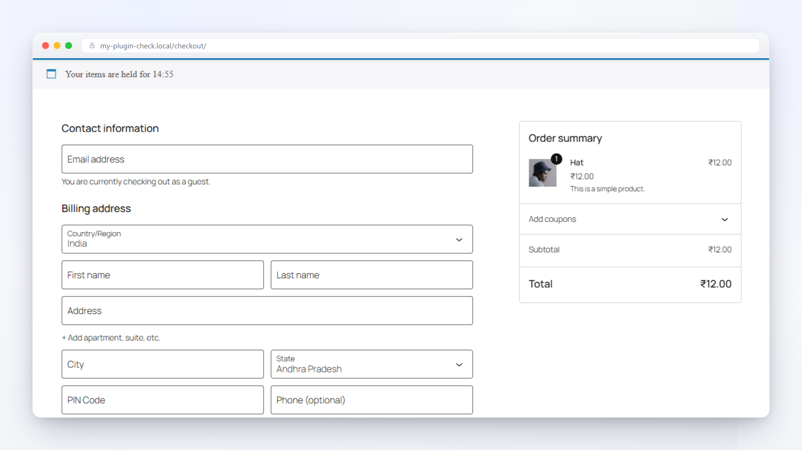
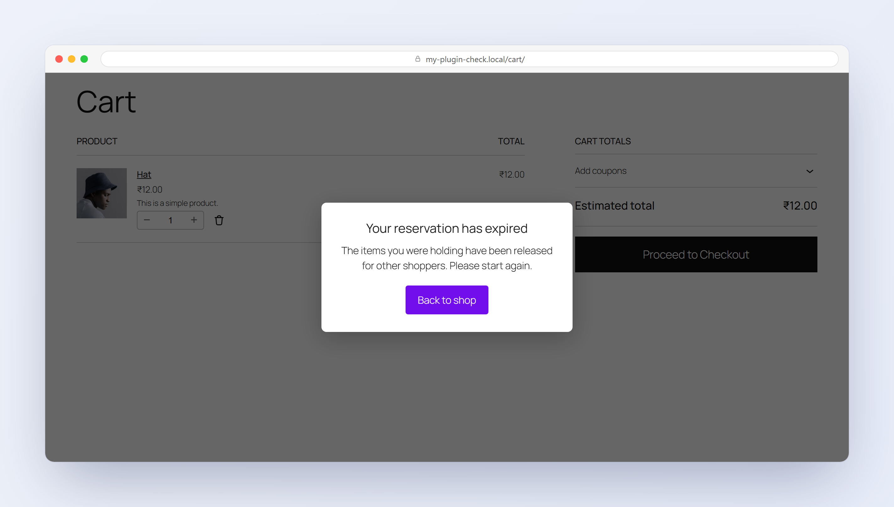

# Flash Sale Stock Guard for WooCommerce

Stop overselling during flash sales and limited drops. Locks stock at add-to-cart on the products you choose, with an optional countdown.

## Screenshots

| | |
|---|---|
|  |  |
| Settings — WooCommerce → Stock Guard | Per-product guard checkbox (Inventory tab) |
|  |  |
| Live countdown — cart page | Live countdown — checkout page |
|  | |
| Expiry pop-up — reservation released | |

## Requirements
- PHP 7.4+
- WordPress 6.4+

## Installation
1. Clone or download this repository into your `wp-content/plugins/` directory.
2. Run `composer install` to install PHP dependencies and setup autoloader. *(Note: On the first run, seeing "No composer.lock file present" is normal; Composer will generate it automatically).*
3. Run `npm install` and `npm run build` to compile JS assets.
   > Note: `assets/build` is gitignored and generated during build.

## Architecture & Services
This plugin uses a modular composition root: `Plugin::create()` builds a `FlashSaleStockGuardWooCommerce\Core\Container` and a list of providers, then `Plugin::boot()` runs each one.
- Providers implement `FlashSaleStockGuardWooCommerce\Contracts\Service_Provider` (`register()` for container bindings, `boot()` for WordPress hooks).
- A provider can optionally implement `FlashSaleStockGuardWooCommerce\Contracts\Conditional` to self-exclude (e.g. only run when a required plugin is active).
- Additional providers can be injected without modifying core files using the `fssgw_providers` WordPress filter.

## Filters & Actions

Everything below is a stable extension point — safe to build on without patching plugin files. Add these to a theme's `functions.php`, a site-specific plugin, or a custom provider registered via `fssgw_providers`.

### `fssgw_hold_ttl`
Change how long a hold lasts, globally or for a specific product/variation. Runs every time a hold is (re)created.

```php
apply_filters( 'fssgw_hold_ttl', int $ttl_seconds, int $product_id, int $variation_id ): int
```

```php
// Give one high-demand product a shorter hold than the store default.
add_filter( 'fssgw_hold_ttl', function ( $ttl, $product_id, $variation_id ) {
	if ( 1234 === $product_id ) {
		return 5 * MINUTE_IN_SECONDS;
	}
	return $ttl;
}, 10, 3 );
```

### `fssgw_is_product_guarded`
Decide guarding by anything the settings screen doesn't cover — category, tag, a campaign flag, a custom field. Runs on top of (not instead of) the store-wide mode and the per-product checkbox; returning `true` here guards a product even if both of those say no.

```php
apply_filters( 'fssgw_is_product_guarded', bool $guarded, int $product_id, int $variation_id ): bool
```

```php
// Guard every product in the "Limited Drop" category, regardless of stock level.
add_filter( 'fssgw_is_product_guarded', function ( $guarded, $product_id ) {
	if ( has_term( 'limited-drop', 'product_cat', $product_id ) ) {
		return true;
	}
	return $guarded;
}, 10, 2 );
```

### `fssgw_release_statuses`
Control which order statuses release a converted (order-backed) hold back to stock. Defaults to `cancelled`, `failed`, `refunded`.

```php
apply_filters( 'fssgw_release_statuses', array $statuses ): array
```

```php
// Also free the stock the moment an order is put on hold.
add_filter( 'fssgw_release_statuses', function ( $statuses ) {
	$statuses[] = 'on-hold';
	return $statuses;
} );
```

### `fssgw_providers`
Register your own `Service_Provider` alongside the plugin's built-in ones — it gets the same `register()`/`boot()` lifecycle, without editing `Plugin.php`.

```php
apply_filters( 'fssgw_providers', array $providers ): array
```

```php
add_filter( 'fssgw_providers', function ( $providers ) {
	$providers[] = new My_Site\Stock_Guard_Slack_Notifier();
	return $providers;
} );
```

### `fssgw_holds_expired`
Fires once per cron sweep (roughly every 5 minutes) after lapsed holds are marked expired — a hook for logging or metrics, not for correctness (availability is already enforced at query time, so a missed sweep never causes overselling).

```php
do_action( 'fssgw_holds_expired', int $expired_count )
```

```php
add_action( 'fssgw_holds_expired', function ( $expired_count ) {
	if ( $expired_count > 0 ) {
		error_log( "Stock Guard: released {$expired_count} lapsed hold(s)." );
	}
} );
```

## WP-CLI Commands
- `wp fssgw status` — Display plugin version and cache backend.

## Development Scripts
- `composer lint` — Run PHPCS checks against WordPress Coding Standards.
- `composer lint:fix` — Automatically fix lint errors with PHPCBF.
- `composer test` — Run the PHPUnit unit test suite (`tests/Unit/` — Brain Monkey, WordPress functions are stubs, no WordPress install needed).
- `composer test:integration` — Run the PHPUnit integration suite (`tests/Integration/` — a real WordPress install via `wp-phpunit/wp-phpunit`, backed by an actual MySQL test database). Set these environment variables first (`WP_TESTS_DB_HOST` defaults to `localhost`):
  - bash / zsh: `export WP_TESTS_DB_NAME=wp_tests WP_TESTS_DB_USER=root WP_TESTS_DB_PASSWORD=root`
  - PowerShell: `$env:WP_TESTS_DB_NAME="wp_tests"; $env:WP_TESTS_DB_USER="root"; $env:WP_TESTS_DB_PASSWORD="root"`
  - cmd.exe: `set WP_TESTS_DB_NAME=wp_tests && set WP_TESTS_DB_USER=root && set WP_TESTS_DB_PASSWORD=root`

  These variables alone aren't enough on every machine — two things they don't handle:
  - **The database must already exist.** `wp-phpunit` installs WordPress into it, it doesn't create it. Run `mysqladmin create wp_tests -u root -p<password>` (or the equivalent for your DB client) once, first.
  - **`localhost` doesn't always mean TCP.** On some setups (notably Docker/CI containers) it resolves to a Unix socket instead of the network address, and the connection fails even with correct credentials. If that happens, set `WP_TESTS_DB_HOST=127.0.0.1` instead — this is exactly why [`.github/workflows/ci.yml`](.github/workflows/ci.yml) uses `127.0.0.1` for its MySQL service rather than `localhost`.
- `npm run build` — Build JS assets for production.
- `npm run start` — Start JS asset dev server in watch mode.
- `npm run test:e2e` — Run Playwright E2E tests against a running WordPress site (`WP_BASE_URL`, defaults to `http://localhost:8889` — e.g. `wp-env start`). See [tests/e2e/README.md](tests/e2e/README.md) for setup and how to add specs.
